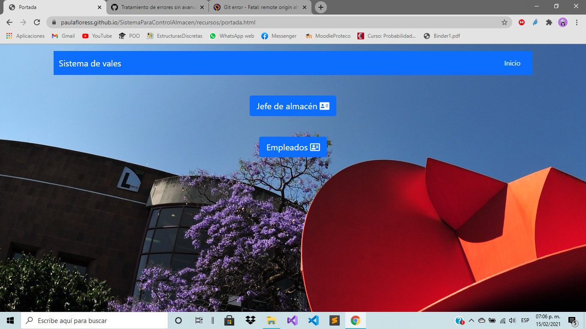
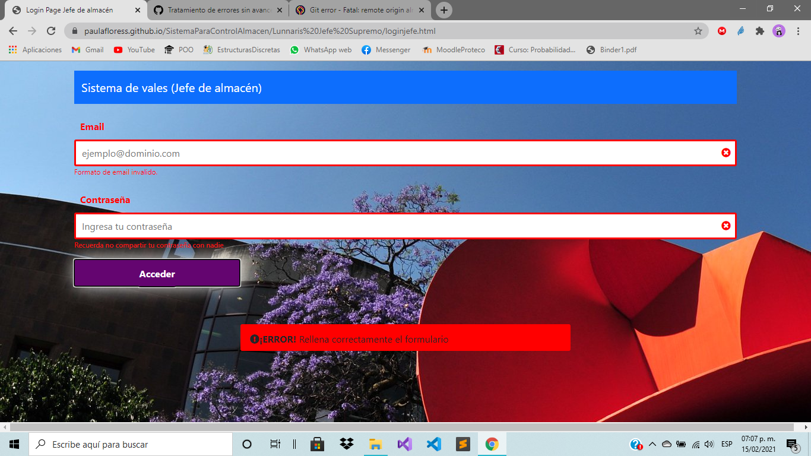

# Sistema para control de vales de almacen

 Este es un sistema de vales de almacen que consta de 4 perfiles

  - Jefe de almacen
  - Jefe de usuarios
  - Usuarios
  - Almacenista
  

 Cada uno tiene su respectivo usuario con contraseña almacenado en la base de datos firebase. Tenemos un precio de los productos, reportes de los productos sacados del almacen, una cantidad mínima y máxima en stock. El usuario puede ver sus vales que contienen los productos que ha comprado. 

	

  
## Algunas capturas de la ejecución

Login en donde puedes elegir la opcion entre ser un almacenista o un empleado. Los empleados son:
	- Jefe de usuarios
	- Almacenista 
	- Usuarios

	

Login validando que los campos se llenen correctamente 

	

